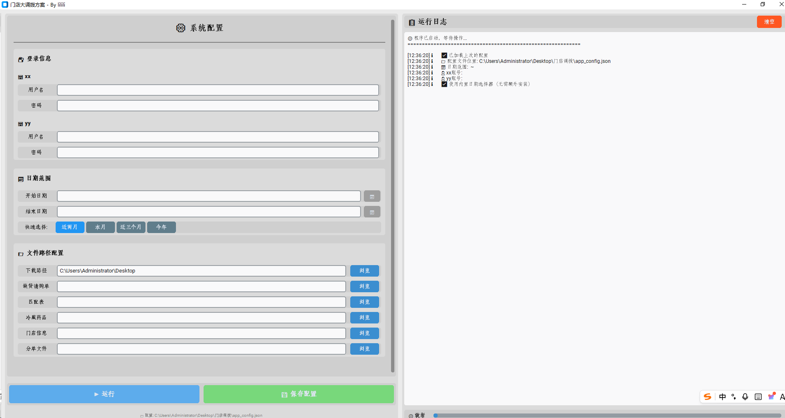

# 门店大调拨方案生成工具

自动化拉取两套业务系统（**ZQ / HH**）的销售、库存与在途数据，经过合并与算法处理后，
生成**门店调拨方案**的辅助工具。内置 GUI（customtkinter），并用 PyInstaller 打包为独立可执行程序。

## 界面预览



## 功能概览

1. **登录** —— 通过 `ddddocr` 自动识别验证码，登录 ZQ、HH 两套系统（带重试机制）。
2. **销售数据导出** —— 按日期区间分批（默认每段 15 天）导出并合并零售决策分析文件。
3. **库存导出** —— 导出当前库存快照。
4. **在途配送导出** —— 分别导出 ZQ、HH 的配送在途数据并合并处理。
5. **调拨方案生成** —— 综合缺口表、销售、库存、在途、冷链、门店面积等输入，产出最终调拨方案。
6. **临时文件清理** —— 运行结束后自动删除中间产物，仅保留最终方案文件。

## 目录结构

```
门店调拨/
├── main.py                      # 流程编排入口（登录 → 导出 → 合并 → 调拨 → 清理）
├── ui.py                        # customtkinter 图形界面
├── login.py                     # 通用登录 + 验证码识别（ddddocr）
├── sales_data.py                # 销售数据相关逻辑
├── sales_data_exporter.py       # 销售数据分批导出
├── inventory_export.py          # 库存导出
├── delivery_data.py             # 在途数据合并
├── zq_delivery_data.py          # ZQ 在途数据导出
├── hh_delivery_data.py          # HH 在途数据导出
├── transfer_scheme_processing.py# 调拨方案核心计算（最大模块）
├── export_file.py               # 通用文件导出工具
├── 门店大调拨.spec               # PyInstaller 打包配置
├── requirements.txt             # 依赖清单（见下方安装说明）
├── .env                         # 运行配置（账号、地址、路径等，不入库）
├── 超人.ico                     # 程序图标
├── .gitignore
└── README.md
```

## 环境依赖

- Python 3.11+
- 主要三方库：`requests`、`pandas`、`numpy`、`openpyxl`、`ddddocr`、`onnxruntime`、`Pillow`、`customtkinter`、`python-dotenv`

依赖版本已固化在 `requirements.txt` 中（基于本仓库 venv 提取，含 `python-dotenv` —— 此前缺失会导致启动报 `No module named 'dotenv'`）。

## 配置（.env）

复制一份 `.env` 并填入实际值（**切勿提交进仓库**）：

```ini
# ZQ 系统地址
ZQ_BASE_URL=https://xmzqdyf.incayun.com
# HH 系统地址
HH_BASE_URL=https://fjhhyy.incayun.com
```

其余运行参数（账号、密码、起止日期、各种文件路径）在 GUI 中填写，或参考 `main.py` 的 `main()` 入参。

## 安装

```bash
python -m venv venv
source venv/bin/activate        # Windows (Git Bash): source venv/Scripts/activate
                                # Windows (cmd):       venv\Scripts\activate.bat
pip install -r requirements.txt
```

> 提示：如 pip 源较慢，可加 `-i https://pypi.tuna.tsinghua.edu.cn/simple`。
> 若 `python-dotenv` 安装后仍报缺失，请确认已激活正确的 venv，并重新执行上面的 pip 安装命令。

## 运行

```bash
python ui.py        # 启动图形界面（推荐）
# 或
python main.py      # 通过代码调用 main() 流程（需手动传参）
```

程序会依次执行登录、四项数据导出、在途合并与调拨方案生成，
最终方案输出到 `.env` / GUI 中指定的下载目录。

## 打包为可执行程序

已提供 `门店大调拨.spec`，使用 PyInstaller 打包：

```bash
pyinstaller 门店大调拨.spec
```

打包产物位于 `dist/`（已被 `.gitignore` 忽略）。
如需调整图标或资源路径，请修改 `.spec` 中的 `icon`、`datas` 字段。

## 注意事项

- **凭证安全**：`.env` 含有账号信息，已被 `.gitignore` 排除，**不要**手动 `git add .env`。
- **验证码识别**：登录依赖 `ddddocr` 自动识别，偶发识别失败会自动重试；若连续失败请检查账号密码。
- **数据文件路径**：缺货表、对照表、冷链表、门店面积表等输入文件路径在运行时指定，请确保存在。
- **依赖完整性**：请务必通过 `requirements.txt` 安装，避免遗漏 `python-dotenv` 等运行必需库。

## 输出说明

最终产出为**门店调拨方案 Excel 文件**；销售、库存、在途等中间文件在流程结束后自动删除。
